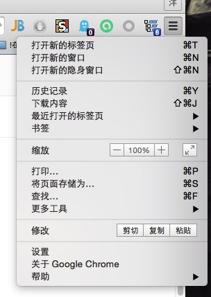
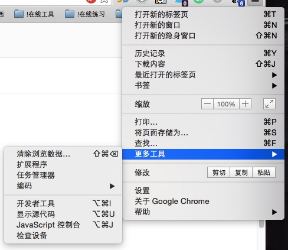
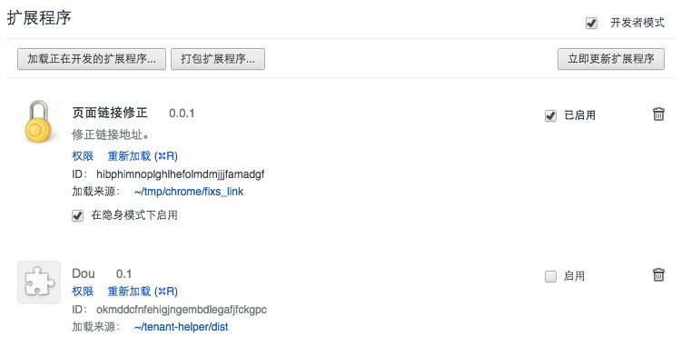
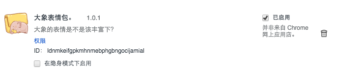

# emoji-extra

美团内部IM大象表情扩展包，让工作聊天多点乐子吧。

## 安装方法

### 右键下载插件

[右键保存插件](https://raw.githubusercontent.com/soulteary/emoji-extra/master/emoji-extra.crx)

### 找到Chrome浏览器的选项按钮。

### 找到扩展程序选项

### 在插件页面打开右上角的开发者选项

### 把下载好的插件拖动到页面上

### 插件安装完毕

### Enjoy

